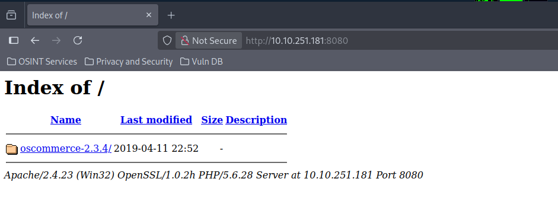
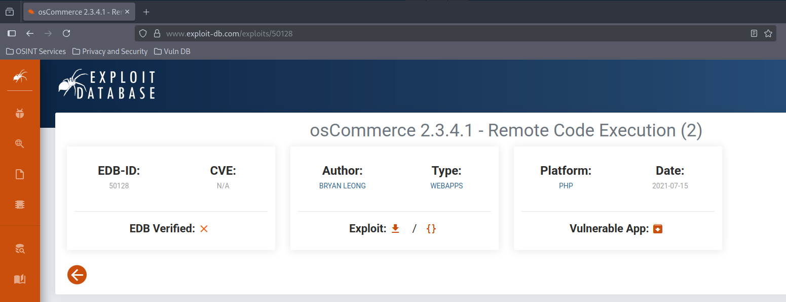
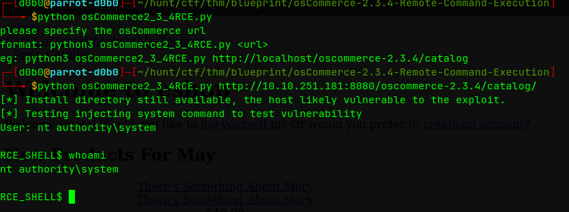
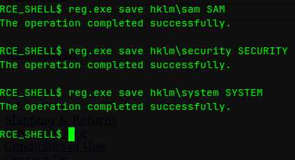
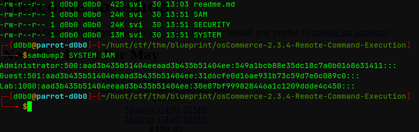

**Hostname:** `BLUEPRINT`

**OS:** Windows 7

**Users:**
```
Lab
```

**Credentials:**
```
Lab:googleplus
```

===============================================================

## Port Scan:

```
PORT      STATE SERVICE      VERSION
80/tcp    open  http         Microsoft IIS httpd 7.5
|_http-server-header: Microsoft-IIS/7.5
|_http-title: 404 - File or directory not found.
| http-methods: 
|_  Potentially risky methods: TRACE
135/tcp   open  msrpc        Microsoft Windows RPC
139/tcp   open  netbios-ssn  Microsoft Windows netbios-ssn
443/tcp   open  ssl/http     Apache httpd 2.4.23 (OpenSSL/1.0.2h PHP/5.6.28)
|_http-title: Index of /
| http-ls: Volume /
| SIZE  TIME              FILENAME
| -     2019-04-11 22:52  oscommerce-2.3.4/
| -     2019-04-11 22:52  oscommerce-2.3.4/catalog/
| -     2019-04-11 22:52  oscommerce-2.3.4/docs/
|_
| tls-alpn: 
|_  http/1.1
|_http-server-header: Apache/2.4.23 (Win32) OpenSSL/1.0.2h PHP/5.6.28
| http-methods: 
|_  Potentially risky methods: TRACE
|_ssl-date: TLS randomness does not represent time
| ssl-cert: Subject: commonName=localhost
| Not valid before: 2009-11-10T23:48:47
|_Not valid after:  2019-11-08T23:48:47
445/tcp   open  microsoft-ds Windows 7 Home Basic 7601 Service Pack 1 microsoft-ds (workgroup: WORKGROUP)
3306/tcp  open  mysql        MariaDB (unauthorized)
8080/tcp  open  http         Apache httpd 2.4.23 (OpenSSL/1.0.2h PHP/5.6.28)
|_http-server-header: Apache/2.4.23 (Win32) OpenSSL/1.0.2h PHP/5.6.28
| http-methods: 
|_  Potentially risky methods: TRACE
|_http-title: Index of /
| http-ls: Volume /
| SIZE  TIME              FILENAME
| -     2019-04-11 22:52  oscommerce-2.3.4/
| -     2019-04-11 22:52  oscommerce-2.3.4/catalog/
| -     2019-04-11 22:52  oscommerce-2.3.4/docs/
|_
49152/tcp open  msrpc        Microsoft Windows RPC
49153/tcp open  msrpc        Microsoft Windows RPC
49154/tcp open  msrpc        Microsoft Windows RPC
49158/tcp open  msrpc        Microsoft Windows RPC
49159/tcp open  msrpc        Microsoft Windows RPC
49160/tcp open  msrpc        Microsoft Windows RPC
Service Info: Hosts: www.example.com, BLUEPRINT, localhost; OS: Windows; CPE: cpe:/o:microsoft:windows

Host script results:
| smb2-time: 
|   date: 2025-05-30T10:50:22
|_  start_date: 2025-05-30T10:41:52
|_nbstat: NetBIOS name: BLUEPRINT, NetBIOS user: <unknown>, NetBIOS MAC: 02:ba:ce:fe:ba:b5 (unknown)
| smb-security-mode: 
|   account_used: guest
|   authentication_level: user
|   challenge_response: supported
|_  message_signing: disabled (dangerous, but default)
|_clock-skew: mean: -29m01s, deviation: 34m37s, median: -9m02s
| smb2-security-mode: 
|   2:1:0: 
|_    Message signing enabled but not required
| smb-os-discovery: 
|   OS: Windows 7 Home Basic 7601 Service Pack 1 (Windows 7 Home Basic 6.1)
|   OS CPE: cpe:/o:microsoft:windows_7::sp1
|   Computer name: BLUEPRINT
|   NetBIOS computer name: BLUEPRINT\x00
|   Workgroup: WORKGROUP\x00
|_  System time: 2025-05-30T11:50:22+01:00

```

===============================================================

## Recon:

### SMB:

**enum4linux:**

```
Nbtstat Information for 10.10.91.33:

Looking up status of 10.10.91.33
	BLUEPRINT       <00> -         B <ACTIVE>  Workstation Service
	WORKGROUP       <00> - <GROUP> B <ACTIVE>  Domain/Workgroup Name
	BLUEPRINT       <20> -         B <ACTIVE>  File Server Service
	WORKGROUP       <1e> - <GROUP> B <ACTIVE>  Browser Service Elections
	WORKGROUP       <1d> -         B <ACTIVE>  Master Browser
	..__MSBROWSE__. <01> - <GROUP> B <ACTIVE>  Master Browser

	MAC Address = 02-BA-CE-FE-BA-B5


Share Enumeration on 10.10.91.33:

	Sharename       Type      Comment
	---------       ----      -------
	ADMIN$          Disk      Remote Admin
	C$              Disk      Default share
	IPC$            IPC       Remote IPC
	Users           Disk      
	Windows         Disk      

[+] Attempting to map shares on 10.10.91.33

//10.10.91.33/ADMIN$	Mapping: DENIED Listing: N/A Writing: N/A
//10.10.91.33/C$	Mapping: DENIED Listing: N/A Writing: N/A

[E] Can't understand response:

NT_STATUS_INVALID_PARAMETER listing \*
//10.10.91.33/IPC$	Mapping: N/A Listing: N/A Writing: N/A
//10.10.91.33/Users	Mapping: OK Listing: OK Writing: N/A
//10.10.91.33/Windows	Mapping: OK Listing: DENIED Writing: N/A

Password Policy Information for 10.10.91.33:

[+] Attaching to 10.10.91.33 using anonymous

[+] Trying protocol 139/SMB...

	[!] Protocol failed: Cannot request session (Called Name:10.10.91.33)

[+] Trying protocol 445/SMB...

[+] Found domain(s):

	[+] BLUEPRINT
	[+] Builtin

[+] Password Info for Domain: BLUEPRINT

	[+] Minimum password length: None
	[+] Password history length: None
	[+] Maximum password age: Not Set
	[+] Password Complexity Flags: 000000

		[+] Domain Refuse Password Change: 0
		[+] Domain Password Store Cleartext: 0
		[+] Domain Password Lockout Admins: 0
		[+] Domain Password No Clear Change: 0
		[+] Domain Password No Anon Change: 0
		[+] Domain Password Complex: 0

	[+] Minimum password age: None
	[+] Reset Account Lockout Counter: 30 minutes 
	[+] Locked Account Duration: 30 minutes 
	[+] Account Lockout Threshold: None
	[+] Forced Log off Time: Not Set```
```

**Anonymous login:**

```
Share           Permissions     Remark
-----           -----------     ------
ADMIN$                          Remote Admin
C$                              Default share
IPC$                            Remote IPC
Users           READ            
Windows
```

### Web Enumeration:

**Vulnerable CMS on port 8080:**
Port 8080 is an HTTP server running an oscommerce 2.3.4 CMS which is vulnerable to Unauthenticated Remote Code Execution by injecting a PHP payload into the db_database parameter of the install.php and read the system command output from configure.php.
https://www.exploit-db.com/exploits/50128

===============================================================
## Foothold / Privilege Escalation:

### Initial Foothold:

After enumerating and manual inspection of port 8080 I found that the server was running a vulnerable version of the OScommerce CMS specifically version 2.3.4, which is vulnerable to an Unauthenticated Remote Code Execution vulnerability.



I found a working script on the exploit-db.com site and used it's syntax to get a shell.
`python exploit.py http://$IP:8080/oscommerce2.3.4/catalog/`





---

### Privilege Escalation:

As I ran the exploit and got a shell, I ran `whoami` and found that the RCE exploit
gives an Administrator shell. I could just into the Administrator directory and extract the root flag.

===============================================================

## Journal:
### User NTLM Hashes:
- Located in registries SAM, SECURITY and SYSTEM
I dumped the hashes using reg.exe:\
`reg.exe save hklm\sam SAM`\
`reg.exe save hklm\security SECURITY`\
`reg.exe save hklm\system SYSTEM`
- This saved the registries to my current working directory



To dump the hashes out of the registry files I used a tool called '**samdump2'**:
```
$ samdump2 SYSTEM SAM
Administrator:500:...
Guest:501:...
Lab:1000:...
```


