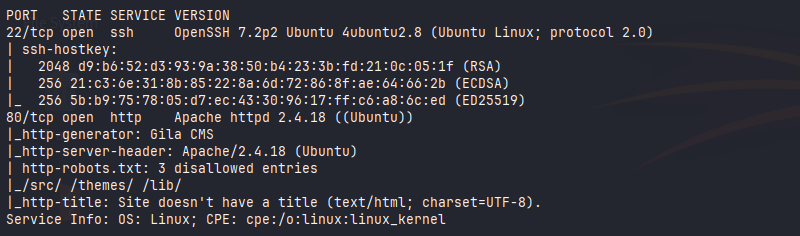
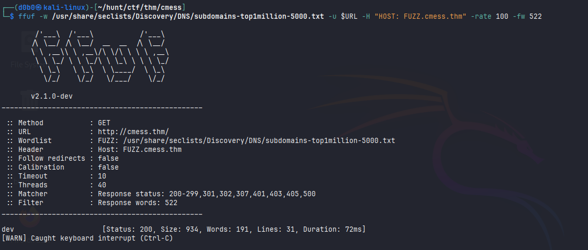
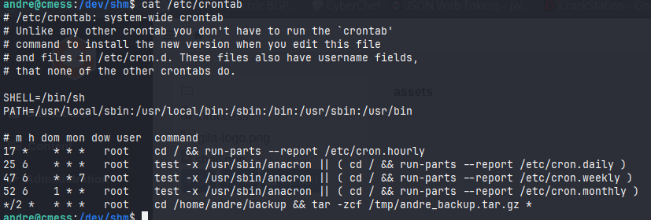
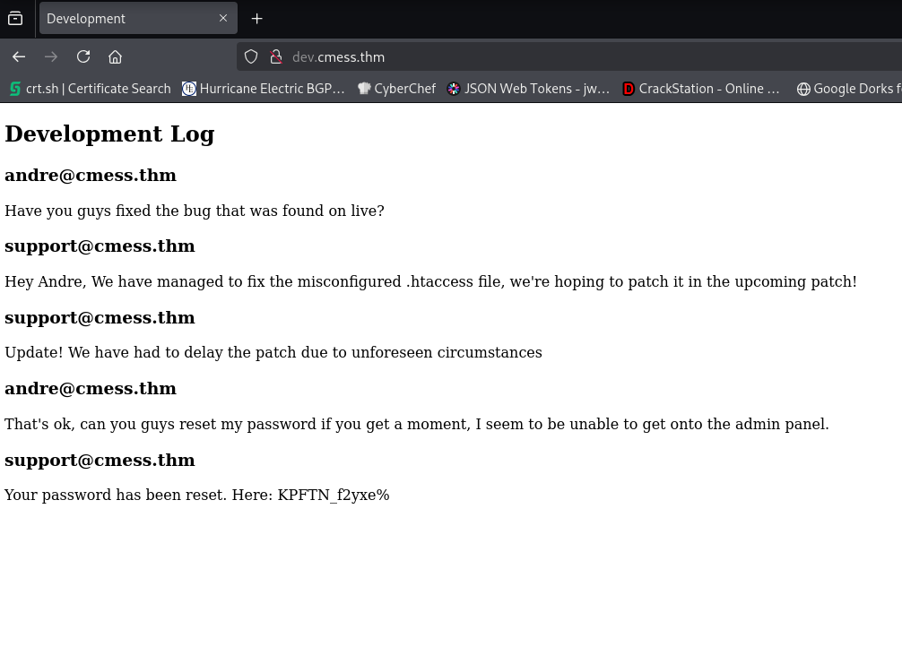
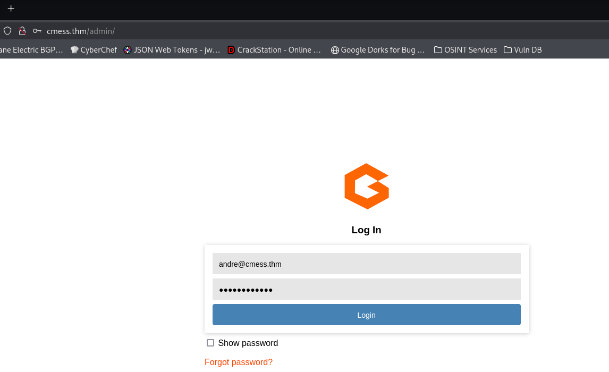
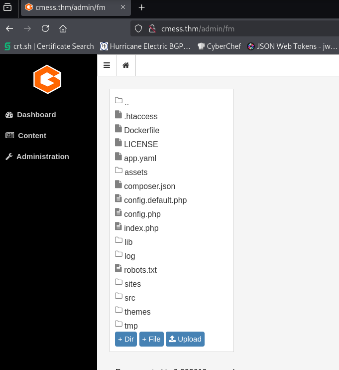
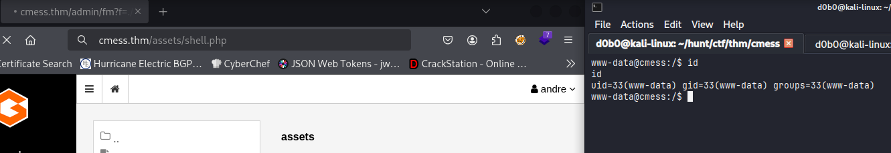
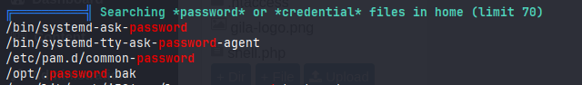
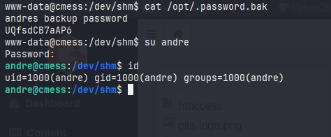
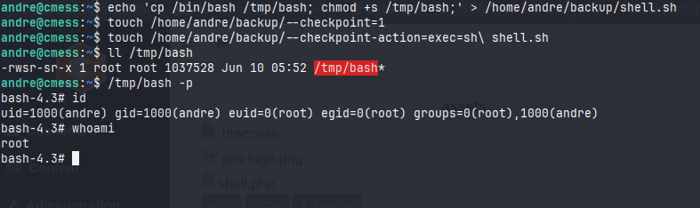

# CMesS

**Hostname:**
`cmess`

**OS:**
`Ubuntu`

**Users:**
`andre`

**Credentials:**

CMS Admin:
`andre@cmess.thm:KPFTN_f2yxe%`

Machine:
`andre:UQfsdCB7aAP6`

## Port Scan:



## Recon:

### Web Recon

**Server:**
`Apache 2.4.18`

**CMS:**
`Gilla CMS 1.10.9`

**robots.txt:**
```
Disallow: /src/ (403)
Disallow: /themes/ (403)
Disallow: /lib/ (403)
```

#### Fuzzing DNS



### Machine

#### Crontab



## Foothold / Privilege Escalation:

### Initial Foothold

I got initial access through an exposed subdomain containing user credentials for the Gila CMS admin panel.

I first fuzzed for subdomains and discovered a subdomain called 'dev'. Upon visiting the subdomain I saw that it contained chat history and clear text password.



Using these credentials I was able to log in to Gila CMS admin panel located on the /admin endpoint



Inside the panel I was able to upload files to the CMS using the File Manager located under Content on the sidebar, so I uploaded a PHP reverse shell.



I found the uploads inside the /assets/ directory and was able to trigger the shell by visiting /assets/shell.php and getting a reverse connection to the setup listener.



### Privilege Escalation:

I was able to get a real user by running linpeas and finding credentials in a hidden file inside the /opt/ directory.





As a real user I did not have any sudo permissions, but a cron job running as root was being done inside that users home directory.
The cron job in question was archiving a wildcarded directory using tar.
I could exploit this since this enables me to create tar commands as file names inside the directory where the process is being executed.

I can use:
```bash
echo 'cp /bin/bash /tmp/bash; chmod +s /tmp/bash;' > /home/andre/backup/shell.sh
touch /home/andre/backup/--checkpoint=1
touch /home/andre/backup/--checkpoint-action=exec=sh\ shell.sh
```
And this will execute the reverse shell script upon performing the archiving and get me a privileged shell since the action is being performed as root.




## Journal:

**Fuzzing for subdomains with `ffuf`**
```
ffuf -w subdomains.txt -u http://domain.com -H "Host: FUZZ.domain.com"
```

### Privilege escalation by tar wildcard archiving
Using file names as tar flags to execute a reverse shell.\
I googled for '*tar wildcard archiving privilege escalation*' and I found this [article](https://medium.com/@polygonben/linux-privilege-escalation-wildcards-with-tar-f79ab9e407fa) which explained how this method works.
```bash
echo 'cp /bin/bash /tmp/bash; chmod +s /tmp/bash;' > /directory/to/tar/shell.sh
touch /directory/to/tar/--checkpoint=1
touch /directory/to/tar/--checkpoint-action=exec=sh\ shell.sh
```
- Executes the shell script upon archiving