# Daily Bugle

**Hostname:**
`dailybugle`

**OS:**
- CentOS

**Users:**

Joomla:
- jonah

Server:
- jjameson

**Credentials:**

Joomla:
`jonah:spiderman123`

Server:
`jjameson:nv5uz9r3ZEDzVjNu`

===============================================================

## Port Scan:

```
PORT     STATE SERVICE VERSION
22/tcp   open  ssh     OpenSSH 7.4 (protocol 2.0)
| ssh-hostkey: 
|   2048 68:ed:7b:19:7f:ed:14:e6:18:98:6d:c5:88:30:aa:e9 (RSA)
|   256 5c:d6:82:da:b2:19:e3:37:99:fb:96:82:08:70:ee:9d (ECDSA)
|_  256 d2:a9:75:cf:2f:1e:f5:44:4f:0b:13:c2:0f:d7:37:cc (ED25519)
80/tcp   open  http    Apache httpd 2.4.6 ((CentOS) PHP/5.6.40)
|_http-generator: Joomla! - Open Source Content Management
|_http-title: Home
|_http-server-header: Apache/2.4.6 (CentOS) PHP/5.6.40
| http-robots.txt: 15 disallowed entries 
| /joomla/administrator/ /administrator/ /bin/ /cache/ 
| /cli/ /components/ /includes/ /installation/ /language/ 
|_/layouts/ /libraries/ /logs/ /modules/ /plugins/ /tmp/
3306/tcp open  mysql   MariaDB 10.3.23 or earlier (unauthorized)
```

===============================================================

## Recon:

### Web Recon:

**Server:**
- Apache 2.4.6

**Languages:**
- PHP 5.6.40

**CMS:**
- Joomla 3.7.0
	- Vulnerable to a SQLi vulnerability
	- Found using joomscan

**robots.txt**

```
Disallow: /administrator/
Disallow: /bin/
Disallow: /cache/
Disallow: /cli/
Disallow: /components/
Disallow: /includes/
Disallow: /installation/
Disallow: /language/
Disallow: /layouts/
Disallow: /libraries/
Disallow: /logs/
Disallow: /modules/
Disallow: /plugins/
Disallow: /tmp/
```


===============================================================

## Foothold / Privilege Escalation:

### Initial Foothold

I saw in wappalyzer results that the CMS running is Joomla. I then used a tool called joomscan to perform a scan and enumerate the version.

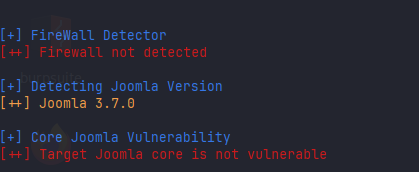

This version of Joomla CMS vas vulnerable to a SQL injection vulnerability which I found by simply googling and found a
working PoC on Github.

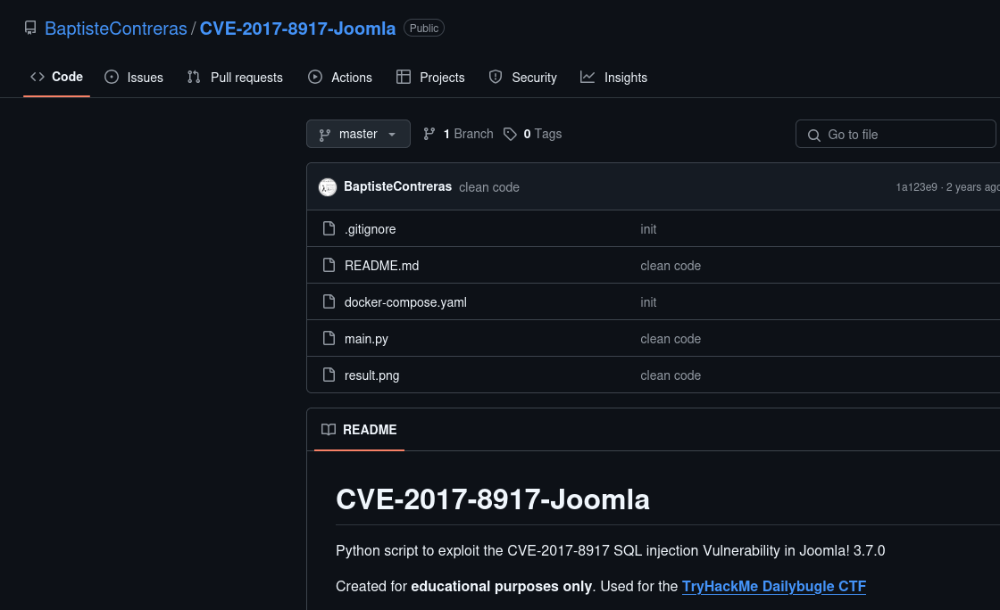

I was able to crack the hash and login to the Joomla admin panel.


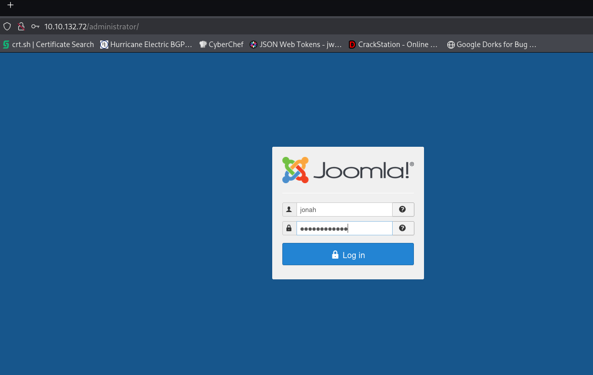

To get a reverse shell I will use the Templates section on the dashboard to edit the current template's error page called error.php. I will replace the code with the PentestMonkeys reverse PHP shell.

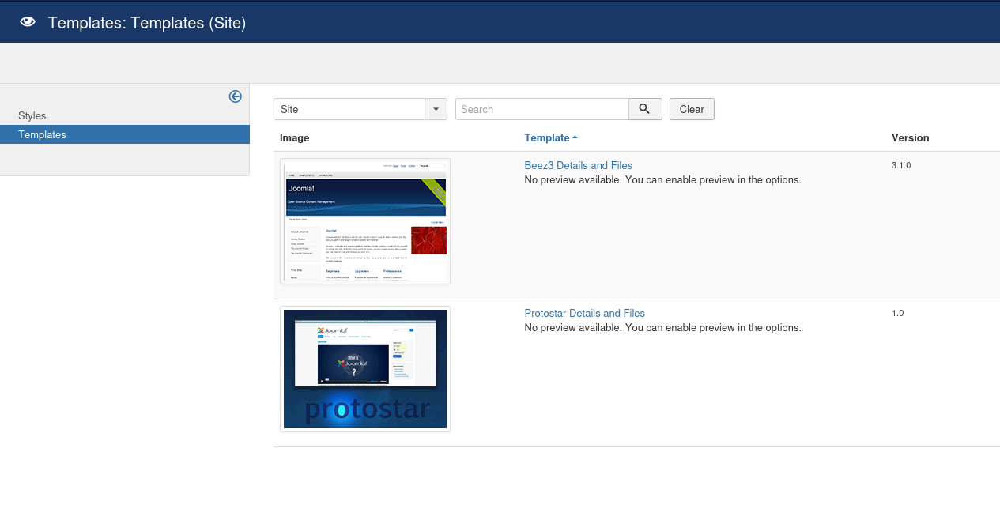

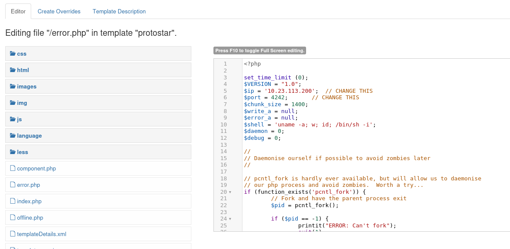

After saving the file I accessed it via $TARGET/templates/protostar/error.php and got a connection to my listener.

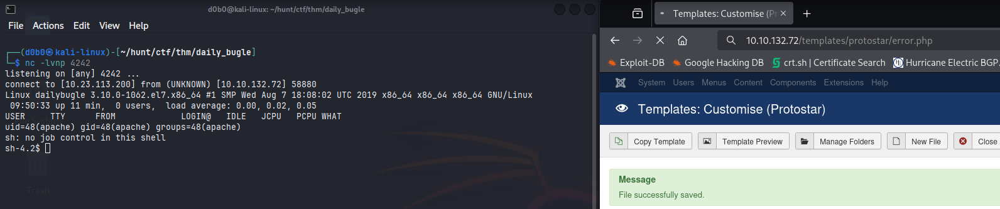


---

### Privilege Escalation:

I first was able to perform a lateral move to a real user called 'jjameson'.
I was able to do that due to credential reusage, the same credentials used for Joomla database are used for the jjameson user.

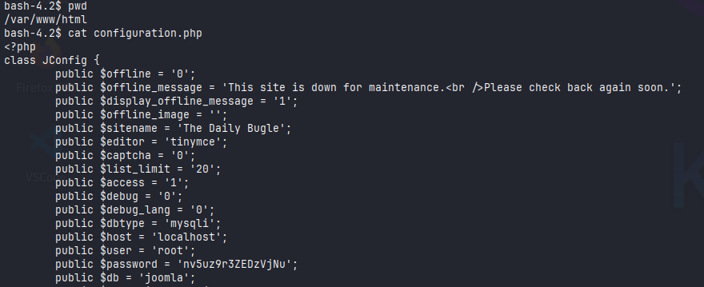

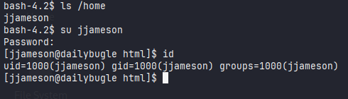

#### Getting root

I elevated my privileges to root via misconfigure sudo permissions. User jjameson had sudo permissions for the yum binary. 

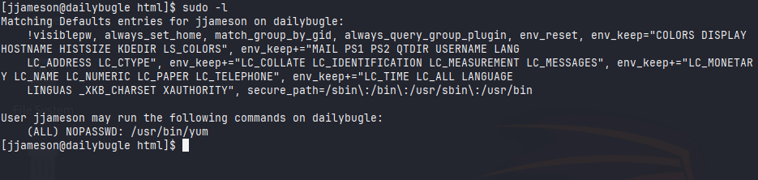

I looked through gtfobins and found this technique:

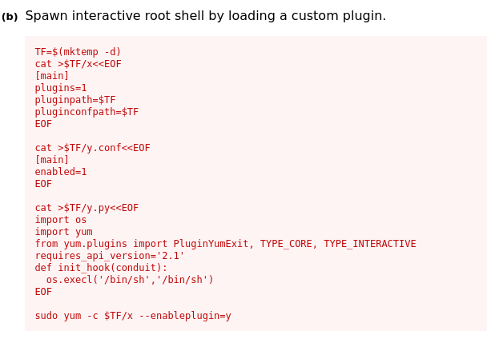

I followed instructions and was successful in getting the root user.

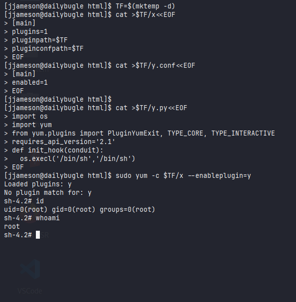

===============================================================

## Journal:
**SQLi python script:**
- https://github.com/BaptisteContreras/CVE-2017-8917-Joomla/blob/master/main.py